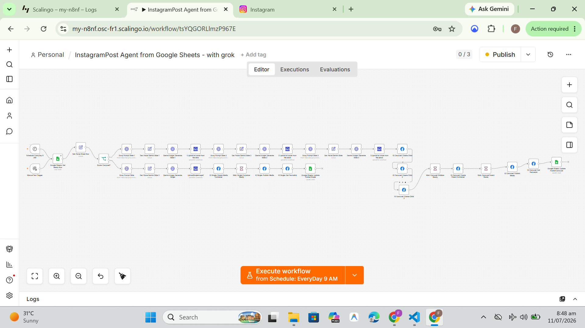
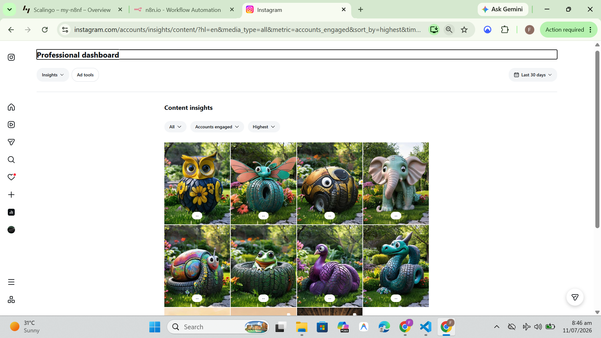

# InstagramPost Agent from Google Sheets with Grok

This repository contains a ready-to-import n8n workflow for generating Instagram posts from Google Sheets rows with prompt-based image creation.

## Contents
- workflows/: the exported n8n workflow JSON
- screenshots/: preview images for documentation and workflow examples

## Screenshots
- Workflow overview: 
- Example output: 

## Getting started
1. Import the workflow JSON into n8n.
2. Configure the required credentials for Google Sheets, Gemini, Cloudinary, and Facebook Graph API.
3. Run the workflow manually to test the pipeline.

## Notes
The workflow expects a Google Sheets row with Status set to Ready and Notes formatted with Prompts, Alt Texts, and Source Caption sections.
